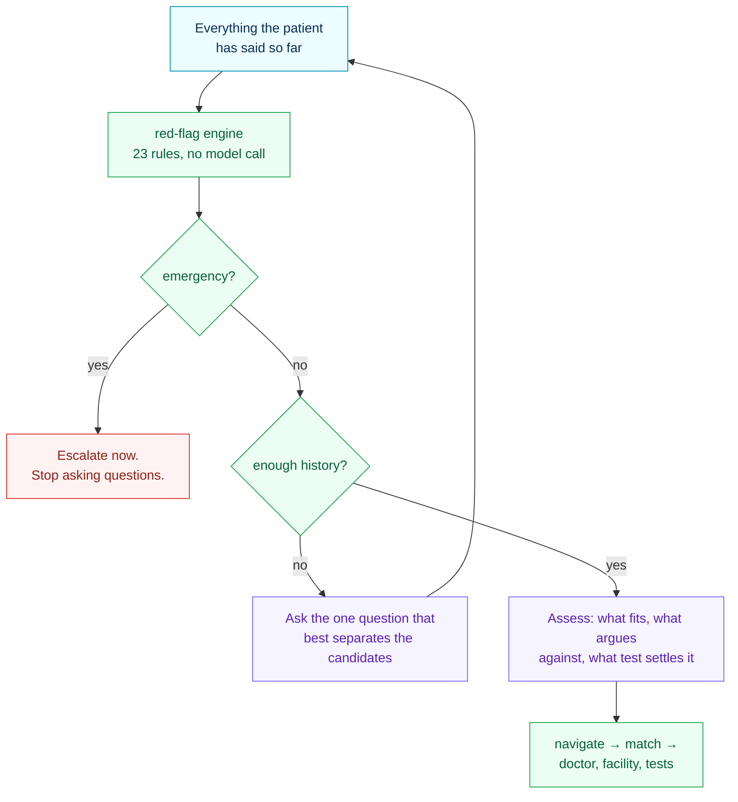
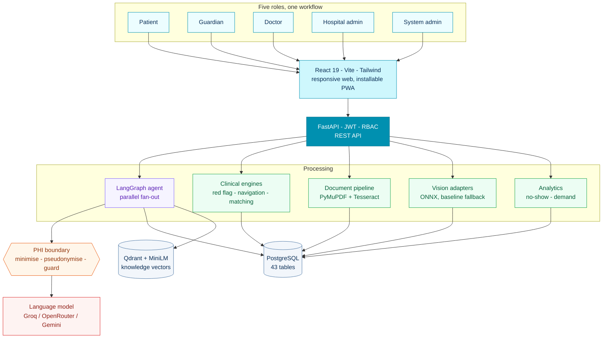
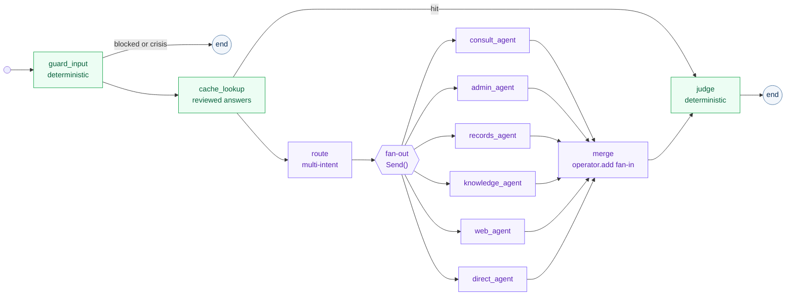
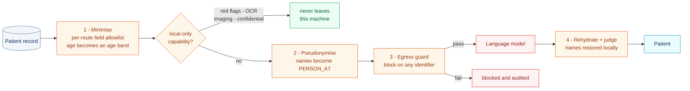
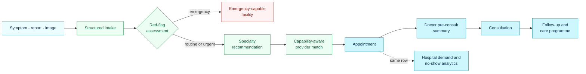

<div align="center">


# SuwaPath

### Your Health. Our Path.

**An AI patient-navigation, clinical-intake and hospital-intelligence platform for Sri Lanka.**

From a symptom, a lab report or a medical image — to the right verified doctor,
at a facility that can actually run the test you need.

`FastAPI` · `PostgreSQL` · `LangGraph` · `Groq` · `Qdrant` · `React` · `TypeScript` · `Tailwind`

Built for **AI Buildathon 2026** · Team **Gmora** · SDG 3 — Good Health and Well-Being

</div>

---

## Table of contents

- [What SuwaPath does](#what-suwapath-does)
- [Highlights](#highlights)
- [The core idea](#the-core-idea)
- [Screens](#screens)
- [Architecture](#architecture)
- [Tech stack](#tech-stack)
- [Getting started](#getting-started)
- [Configuration](#configuration)
- [Demo accounts](#demo-accounts)
- [Demo walkthroughs](#demo-walkthroughs)
- [Design system](#design-system)
- [Project structure](#project-structure)
- [API overview](#api-overview)
- [Testing and verification](#testing-and-verification)
- [Plugging in your own CV model](#plugging-in-your-own-cv-model)
- [Seeded dataset](#seeded-dataset)
- [The autonomy layer](#the-autonomy-layer)
- [Privacy, consent and safety](#privacy-consent-and-safety)
  - [How the PHI boundary works](#how-the-phi-boundary-works)
  - [Data at rest](#data-at-rest)
  - [Private mode](#private-mode)
- [Implementation status](#implementation-status)
- [Troubleshooting](#troubleshooting)
- [Roadmap](#roadmap)
- [Disclaimer](#disclaimer)

---

## What SuwaPath does

Healthcare access often fails *before* a patient reaches a clinician. People are
unsure whether a symptom is urgent, which specialty is appropriate, which
hospital has the right doctor or scanner, or what their lab report actually
means. They search across disconnected websites and booking services, repeat the
same history at every stage, and frequently give up.

SuwaPath turns an unstructured concern into a structured, trackable care
journey:

```
patient concern → structured intake → red-flag assessment → care level
   → specialty → doctor / hospital / test-facility match → appointment
   → doctor pre-consult summary → consultation → follow-up → care programme
```

The same records serve five roles — **patients**, **guardians**, **doctors**,
**hospital administrators** and **system administrators** — so a booking made by
a patient appears instantly in the doctor's live queue and in the hospital's
demand forecast. It is one workflow, not five dashboards.

---

## Highlights

| | |
|---|---|
| **One assistant, not three screens** | Symptoms, reports, appointments and the confidential pathway are a single conversation. It takes a history the way a doctor does — up to four targeted questions — before it says anything. |
| **Multilingual symptom intake** | Conversational triage in **English, Sinhala and Tamil**. Sinhala and Tamil input fires the same clinical rules as English — matching is on concepts, not translated strings — to the extent the lexicon lists the phrasing used, which is its real limit. |
| **Deterministic red-flag engine** | 23 clinician-style rules decide urgency. **The LLM never does.** Chest pain + breathlessness + sweating → `EMERGENCY`, every time, in any language. |
| **Capability-aware matching** | The differentiator. Not just "a dermatologist near you", but a dermatologist at a facility that can perform the **skin biopsy** the recommendation calls for. |
| **Medical report understanding** | OCR reads lab PDFs and photographed scans, preserves table row structure, and flags values against **the reference range printed on your own report**. |
| **Medical image screening** | Chest X-ray screening with confidence, an occlusion-sensitivity heatmap, and a hand-off into care navigation. Pluggable adapters for future models. |
| **Care programmes** | Maternal/postpartum with danger-sign check-ins, elderly care with medication adherence and pattern-based guardian alerts, and a confidential sexual-health pathway. |
| **Consent-controlled guardians** | Deny-by-default. A guardian sees only what the patient explicitly granted, and withheld sections are shown as withheld rather than silently hidden. |
| **Hospital intelligence** | No-show risk and 7-day specialty demand forecasting, both fitted on the hospital's own historical appointments. |
| **Private mode** | Encrypted under a key derived from the user's PIN and never stored, so the server cannot read it unattended. Invisible in history, gone in 12 hours. |
| **Reasons, not just retrieves** | A bounded plan-act-observe loop chooses its own lookups and stops when it has enough. The planner sees whether a lookup returned anything, never what it returned. |
| **Every role has an agent** | Patients, doctors, guardians, hospital administrators and system administrators all both receive and originate autonomous work. |
| **Models that are measured** | AUC, Brier and calibration on held-out data, shown on the dashboard beside the predictions they grade. |
| **Acts without being asked** | Eight detectors run on a schedule and notice what nobody reports: care that was recommended but never booked, doses that stopped being taken, appointments that elapsed, check-ins that stopped. |
| **Prepares, then asks** | A stalled referral becomes a specific bookable action — named doctor, a facility that can run the required test, real slot, real fee — waiting on one tap. Nothing clinical is ever automated. |
| **Encrypted at rest** | AES-256-GCM over conversation content in the application layer, not just on the disk, with a 90-day retention window. |
| **Answers before generating** | Greetings and product FAQs return reviewed answers from cache in ~0 ms. Nothing clinical is ever cached — near-identical questions have completely different correct answers. |
| **Works without any API key** | Three model providers are tried in order and none is required. With none set, every feature still runs on deterministic engines and composers. Nothing hard-fails in a demo. |

---

## The core idea

### The LLM never decides urgency

This is the load-bearing safety property. A language model does language work
— asking natural follow-up questions, extracting structure, explaining findings
in plain language. A separate deterministic engine decides the care level, and it
**re-derives symptom concepts from the patient's own words** rather than
trusting the model's symptom list. A hallucinated or omitted symptom therefore
cannot change the care level.

LangGraph makes this a structural property rather than a convention. The
red-flag engine runs over the accumulated transcript on **every** turn of a
consultation, before the assistant decides whether to ask another question or
answer:



Nothing reaches `navigate` without traversing the red-flag engine, and a
patient who mentions crushing chest pain on turn one is not asked three more
questions first. Every session returns its orchestration trace, so the path
taken is visible in the UI as it happens.

### Assist, and say so

SuwaPath is the step before the clinic, and the output says that plainly. An
assessment names what fits *and what argues against it*, suggests the tests
that would actually settle the question, and ends by stating that it cannot be
certain without an examination.

That last part is not legal boilerplate. An assistant that sounds certain is
one patients stop verifying — and the entire value of routing someone to the
right specialist evaporates if they decide they no longer need to go.

### Multilingual by concept, not translation

`app/clinical/lexicon.py` maps ~90 clinical concepts to the surface forms
patients actually type — English, Sinhala, Tamil, and romanised transliteration.

```
"I have pain in my chest and shortness of breath"    → EMERGENCY · RF-CARD-001
"මට පපුවේ කැක්කුම සහ හුස්ම ගැනීමේ අපහසුතාව තියෙනවා"    → EMERGENCY · RF-CARD-001
```

A second proximity pass catches phrasing the literal index cannot: *"my eye is
red and painful"* resolves to ophthalmology without the phrase "eye pain" ever
appearing.

### Capability-aware matching

A recommendation carries **required capabilities**, not just a specialty. Ten
ranking factors are scored and returned with a per-factor breakdown, and every
result explains itself:

> *"Recommended because this doctor specialises in dermatology, they have an
> appointment tomorrow, and they practise at a facility providing skin biopsy
> and histopathology."*

Emergency capability overrides ranking preference entirely — an emergency
recommendation only ever surfaces emergency-capable facilities.

---

## Screens

Reference designs live in [`Ui mocks/`](Ui%20mocks). The implemented UI follows
their visual language — teal/cyan brand, navy text, calm card surfaces — with a
lighter information density and role-specific responsive layouts.

| Role | Desktop | Mobile |
|---|---|---|
| **Patient** | Action-first dashboard, symptom chat, provider matching, report and image intelligence | Bottom tab bar, stacked cards |
| **Guardian** | Dependent cards, consent-scoped detail, alert stream | Same, tab bar |
| **Doctor** | Live queue table, pre-consultation summary with original patient answers | Queue rows become readable cards |
| **Hospital admin** | KPI row, demand-vs-capacity charts, no-show risk table | Charts reflow, tables scroll |
| **System admin** | Platform overview, user management, live AI configuration | Responsive |

---

## Architecture



The green nodes never call a hosted model. Everything clinically decisive —
urgency, provider ranking, lab flagging, image inference — is computed locally
and deterministically. The language model handles language, not judgement.

### The agent graph



**One conversation, not three.** Symptom checking, record explanation and the
confidential advisor used to be separate screens that could not see each
other. They are one chat now: the same turn can take a history, read a lab
value and offer a doctor.

**`cache_lookup` answers before generating.** Greetings and product FAQs are
matched by normalised text and by embedding similarity against reviewed
answers, and returned in ~0 ms without touching a model. This is a safety
feature as much as a speed one — the answer to "is my data private?" must be
identical every time. Nothing clinical is ever cached: two patients asking
"is this chest pain serious?" produce near-identical embeddings and completely
different correct answers.

**`consult_agent` takes a history.** Rather than answering the first sentence,
it asks up to four questions, each chosen to discriminate between the
explanations still in play, then writes an assessment: what fits, what argues
against it, which test would settle it, and who to see. A red-flag hit stops
question-asking immediately.

**Parallel fan-out.** "Is my appointment still on, and what did my blood test
mean?" is two questions. The router splits it and `Send()` dispatches both
agents in one superstep. Each returns a single-element list and the
`operator.add` reducer on `agent_outputs` concatenates them on fan-in —
without that reducer the concurrent writes would conflict and one agent's work
would be dropped silently.

Routes are then pruned: `direct` is dropped whenever anything substantive was
also selected, and a reply to our own follow-up question stays on `consult`
alone. Left unpruned, an empty catch-all answer gets merged into a good one
and the reply contradicts itself.

The router falls back to deterministic multi-intent keyword splitting when no
provider answers, so fan-out still happens with zero API quota.

**`judge` may soften or block. It can never raise urgency** — that stays with
the deterministic red-flag engine. If a judge could escalate, a prompt
injection would become a way to manufacture emergencies.

### Language models: three providers, none required

No single free tier is reliable enough to build on, so three are tried in
order and each may fail independently:

| Order | Provider | Model | Measured |
| --- | --- | --- | --- |
| 1 | Groq | `llama-3.3-70b-versatile` / `llama-3.1-8b-instant` | 160–450 ms |
| 2 | OpenRouter | `nvidia/nemotron-3-ultra-550b-a55b:free` | 1.3–3 s |
| 3 | Gemini | `gemini-2.0-flash` | free keys are often provisioned `limit: 0` |
| — | none | deterministic composers | always available |

A provider that fails is put on a 60-second cooldown rather than retried on
every request, so one dead key does not add its timeout to every turn. A
`400` is treated as our own malformed request and does **not** earn a
cooldown — punishing a healthy provider for our bug would push every
subsequent turn to a slower fallback.

With no key at all the product still works end to end. The deterministic
composers write structured markdown from the engines' own output rather than
dumping raw tool text, so a quota outage degrades the wording and nothing else.

### What crosses the PHI boundary

Masking alone is not an answer. `app/privacy/boundary.py` applies four layers,
in order, and the earlier ones do most of the work:



A worked example, taken from the module's own check:

| Stage | Value |
| --- | --- |
| Record | `age: 34, full_name, email, latitude, symptoms: ["chest pain"]` |
| After minimise (`clinical` route) | `age_band: "adult_18_39", symptoms: ["chest pain"]` |
| Stripped | `full_name`, `email`, `latitude` |
| Egress guard | blocks the payload outright if an email or NIC survives |

Consent is enforced in the **database query**, not in the prompt. A guardian
asking the same question about two dependents gets two different answers
because the tool never reads what was not shared — the model is never in a
position to be talked out of it.

### The shared care journey



One `Appointment` row is what the patient books, what appears in the doctor's
live queue, and what the hospital counts in its forecast. It is one workflow
seen from five angles — not five disconnected dashboards.

---

## Tech stack

**Backend** — Python 3.12 · FastAPI · SQLAlchemy 2 · PostgreSQL 16 · PyJWT ·
bcrypt

**AI** — LangGraph (orchestration graph) · Groq / OpenRouter / Gemini with
automatic failover (language) ·
Qdrant + `fastembed` MiniLM ONNX (semantic knowledge retrieval) ·
PyMuPDF + Tesseract (OCR) · onnxruntime (computer vision)

**Frontend** — React 19 · TypeScript · Vite · Tailwind CSS 3 · React Router 7 ·
Recharts · Axios

**Analytics** — Logistic regression (no-show) and additive time-series
decomposition (demand), both implemented directly so the coefficients are
inspectable.

---

## Getting started

No Docker is needed for local development. Everything runs natively: the only
service is PostgreSQL, and the vector store is an embedded on-disk Qdrant that
starts with the process. Containers are for deployment later, not for getting
this running today.

### Prerequisites

| Requirement | Version | Why |
| --- | --- | --- |
| Python | 3.12+ | Backend |
| Node.js | 20+ | Frontend |
| PostgreSQL | 16+ | The only external service |
| Tesseract OCR | 5+ | Only for scanned documents without a text layer |

<details open>
<summary><b>macOS</b></summary>

```bash
brew install postgresql@16 tesseract node python@3.12
brew services start postgresql@16
```
</details>

<details>
<summary><b>Linux (Debian / Ubuntu)</b></summary>

```bash
sudo apt update
sudo apt install -y postgresql-16 tesseract-ocr python3.12 python3.12-venv nodejs npm
sudo systemctl start postgresql
```

On Fedora / RHEL: `sudo dnf install postgresql-server tesseract python3.12 nodejs`
then `sudo postgresql-setup --initdb && sudo systemctl start postgresql`.
</details>

<details>
<summary><b>Windows</b></summary>

Using [winget](https://learn.microsoft.com/windows/package-manager/):

```powershell
winget install PostgreSQL.PostgreSQL.16
winget install UB-Mannheim.TesseractOCR
winget install OpenJS.NodeJS.LTS
winget install Python.Python.3.12
```

Two Windows-specific notes:

- Add Tesseract to `PATH` (typically `C:\Program Files\Tesseract-OCR`), or
  set `TESSERACT_CMD` in `.env` to its full path.
- The PostgreSQL installer runs the server on port **5432** by default, not
  5436. Set `DATABASE_URL` accordingly — see step 1.

WSL2 works too, and if you use it, follow the Linux instructions inside it.
</details>

### 1 · Create the database

The default `DATABASE_URL` points at port **5436**, which is what this
project's Homebrew instance was configured with. Most installations use
**5432** — check yours and edit `.env` rather than reconfiguring PostgreSQL.

<details open>
<summary><b>macOS / Linux</b></summary>

```bash
createdb -h 127.0.0.1 -p 5436 suwapath
```
</details>

<details>
<summary><b>Windows (PowerShell)</b></summary>

```powershell
& "C:\Program Files\PostgreSQL\16\bin\createdb.exe" -h 127.0.0.1 -p 5432 -U postgres suwapath
```
</details>

<details>
<summary>PostgreSQL won't start on macOS</summary>

If the postmaster exits immediately, start it with `LC_ALL=C`. Homebrew's
build can become multithreaded during locale initialisation and refuses to
boot:

```bash
LC_ALL=C pg_ctl -D /opt/homebrew/var/postgresql@16 start
```
</details>

### 2 · Backend

> **Every command below runs from inside `backend/`.** The virtualenv lives at
> `backend/.venv`, so `.venv/bin/python` from the repo root fails with
> `no such file or directory`. If you `cd` away for anything, `cd backend`
> again before continuing.

<details open>
<summary><b>macOS / Linux</b></summary>

```bash
cd backend
python3 -m venv .venv
.venv/bin/pip install -r requirements.txt

cp ../.env.example ../.env          # then add your API keys — all optional

PYTHONPATH=. .venv/bin/python -m app.seed.seeder --reset
PYTHONPATH=. .venv/bin/uvicorn app.main:app --port 8000
```
</details>

<details>
<summary><b>Windows (PowerShell)</b></summary>

```powershell
cd backend
py -3.12 -m venv .venv
.venv\Scripts\pip install -r requirements.txt

Copy-Item ..\.env.example ..\.env   # then add your API keys — all optional

$env:PYTHONPATH = "."
.venv\Scripts\python -m app.seed.seeder --reset
.venv\Scripts\uvicorn app.main:app --port 8000
```
</details>

Seeding takes about 15 seconds and prints the demo accounts when it finishes.
The first run also downloads the ~90 MB MiniLM embedding model.

- API: <http://127.0.0.1:8000>
- Interactive docs: <http://127.0.0.1:8000/docs>
- Health and provider status: <http://127.0.0.1:8000/health>

### 3 · Frontend

Identical on all three platforms:

```bash
cd frontend
npm install
npm run dev
```

Open <http://localhost:5173>.

### 4 · Verify

```bash
cd backend && PYTHONPATH=. .venv/bin/python tests/test_scenarios.py
```

Runs all seven required demo scenarios plus RBAC boundary checks against the
live API. Expect **73 checks, 0 failures**.

Two suites need no server and no database, so they are the quickest way to
tell whether a change broke something structural:

```bash
cd backend
PYTHONPATH=. .venv/bin/python tests/test_enums.py
PYTHONPATH=. .venv/bin/python tests/test_eligibility.py
```

### 5 · Starting daily development

You **do not** need to create or seed the database every time. The database setup steps above are strictly for the first run. The database runs automatically in the background on your machine.

To start the platform on subsequent days, run these two commands in separate terminal windows:

**Terminal 1 (Backend API):**
```bash
cd backend
# Mac / Linux:
.venv/bin/uvicorn app.main:app --port 8000
# Windows:
.venv\Scripts\uvicorn app.main:app --port 8000
```

**Terminal 2 (Frontend):**
```bash
cd frontend
npm run dev
```

---

## Configuration

All configuration is environment-driven. Copy `.env.example` to `.env`.

| Variable | Default | Purpose |
|---|---|---|
| `DATABASE_URL` | local socket, port 5436 | PostgreSQL connection |
| `JWT_SECRET` | dev value | **Change before any deployment** |
| `GROQ_API_KEY` | *(empty)* | First-choice model provider. Fastest free tier by a wide margin. |
| `GROQ_MODEL` | `llama-3.3-70b-versatile` | Used for answers |
| `GROQ_FAST_MODEL` | `llama-3.1-8b-instant` | Used for routing and classification |
| `OPEN_ROUTER_API_KEY` | *(empty)* | Second choice. Free model slugs. |
| `OPEN_ROUTER_MODEL` | `nvidia/nemotron-3-ultra-550b-a55b:free` | Model id |
| `GEMINI_API_KEY` | *(empty)* | Third choice |
| `GEMINI_MODEL` | `gemini-2.0-flash` | Model id |
| `TAVILY_API_KEY` | *(empty)* | Optional web search. Current public information only — never clinical decisions. |
| `QDRANT_URL` | *(empty)* | Empty ⇒ embedded on-disk Qdrant in `backend/storage/qdrant` |
| `EMBEDDING_MODEL` | `sentence-transformers/all-MiniLM-L6-v2` | Retrieval embeddings |
| `SCHEDULER_ENABLED` | `true` | Runs the autonomy layer. Off disables all detectors. |
| `AGENTIC_ENABLED` | `true` | Master switch for autonomous behaviour |
| `LOCAL_TIMEZONE` | `Asia/Colombo` | Medication times, quiet hours and daily job buckets are local-calendar concepts |
| `SMS_PROVIDER` | *(empty)* | Empty ⇒ no-op provider: delivery is recorded, nothing is sent |
| `SUWAPATH_ENCRYPTION_KEY` | *(empty)* | Base64 32-byte AES-256-GCM key for stored conversations. Empty stores plaintext. **Set before any deployment — losing it makes existing conversations unreadable.** |

Generate an encryption key with:

```bash
python3 -c "import os,base64;print(base64.urlsafe_b64encode(os.urandom(32)).decode())"
```

**Every model key is optional.** With none of them set the platform still runs
end to end on its deterministic composers — see
[the provider table](#language-models-three-providers-none-required). Setting
just `GROQ_API_KEY` gets you the best latency for the least effort.

Check what is actually live at runtime:

```bash
curl -s http://127.0.0.1:8000/health | python3 -m json.tool
```

Or sign in as the system administrator and open **AI Configuration**.

---

## Demo accounts

Password for all accounts: `Demo@1234`

| Email | Person | Role |
|---|---|---|
| `patient@suwapath.lk` | Nimali Fernando | Patient |
| `maternal@suwapath.lk` | Dilini Fernando | Patient — 28 weeks pregnant |
| `elderly@suwapath.lk` | Sunil Fernando | Patient — elderly care, large-text UI |
| `guardian@suwapath.lk` | Nimal Fernando | Guardian of both patients above |
| `doctor@suwapath.lk` | Dr. Dileepa Perera | Doctor — Endocrinology |
| `hospital@suwapath.lk` | Chathurika Bandara | Hospital administrator |
| `admin@suwapath.lk` | Ravindu Wickramasinghe | SuwaPath system administrator |

Confidential sexual-health mode needs no account at all: **`/private`**.

---

## Demo walkthroughs

<details>
<summary><b>A · Symptom navigation → the doctor's queue</b></summary>

1. Sign in as `patient@suwapath.lk` → **Symptom Check**.
2. Type *"I have pain in my chest and I feel dizzy"*. The assistant asks
   follow-up questions rather than jumping to a recommendation.
3. Answer a few; the session completes and shows the structured intake, the
   fired red-flag rules (`RF-CARD-001`), `EMERGENCY` urgency and a cardiology
   recommendation with reason and confidence.
4. **See matching doctors** → results explain themselves and are restricted to
   emergency-capable facilities. Book a slot.
5. Sign in as `doctor@suwapath.lk` → the patient is already in the live queue.
   Open them for the pre-consultation summary — with the original conversation
   preserved alongside the AI-extracted structure.

</details>

<details>
<summary><b>B · Medical report understanding</b></summary>

Sign in as a patient → **Medical Reports** → upload
`backend/storage/samples/cbc_report.pdf` (or `cbc_report_scan.png` to force the
Tesseract path). Extracted rows keep their order, the low haemoglobin is flagged
against the range printed on the report, and a plain-language explanation leads
into provider matching.

</details>

<details>
<summary><b>C · Medical image screening</b></summary>

**Image Screening** → upload `backend/storage/samples/chest_xray_pneumonia.png`.
You get a finding, confidence, a heatmap of the regions that drove the result,
and a route into respiratory medicine. Uploading `not_an_xray.png` is rejected
by modality validation before any inference runs.

</details>

<details>
<summary><b>D · Maternal danger sign → consented guardian alert</b></summary>

Sign in as `maternal@suwapath.lk` → **Care Programmes**. The dashboard shows
pregnancy week 28. Submit a check-in reporting *severe headache* **and**
*blurred vision*: the pre-eclampsia rule fires, escalation appears, and the
guardian is alerted. Sign in as `guardian@suwapath.lk` — the alert is there, but
her **reports remain withheld**, because she never granted that scope.

</details>

<details>
<summary><b>E · Elderly missed medication → guardian books follow-up</b></summary>

`elderly@suwapath.lk` has three consecutive missed doses of a critical
medication. Pattern detection raises a guardian alert (a *run* of misses, not
every single event). As `guardian@suwapath.lk`, open the dependent and book a
follow-up on their behalf.

</details>

<details>
<summary><b>F · Confidential sexual health</b></summary>

Go to `/private` — no account. Answer the structured questions and get
window-period-aware testing guidance, confidential facilities, and a recovery
code. Delete the session; the recovery code stops working immediately.

</details>

<details>
<summary><b>G · Hospital intelligence</b></summary>

Sign in as `hospital@suwapath.lk`. Real KPIs from seeded data, a 7-day forecast,
and a capacity warning computed from actual published schedule capacity
(obstetrics typically ~75 predicted vs 60 capacity).

</details>

---

## Design system

The visual system is centralised so it can be changed in one place — there are
no ad-hoc colours, radii or shadows in page code.

```
frontend/src/styles/
  tokens.css       ← single source of truth: brand ramp, ink ramp, status
                     tones, typography scale, radii, shadows, layout metrics
  components.css   ← every reusable pattern as a named class (.sp-btn,
                     .sp-card, .sp-chip, .sp-table, .sp-tabbar, …)
  theme.ts         ← JS mirror; chart colours read the same tokens at runtime
tailwind.config.js ← Tailwind colours map to the CSS variables
```

**To restyle the product, edit `tokens.css`.** Tailwind utilities, component
classes and Recharts all resolve to the same variables.

The brand ramp is sampled from the actual logo (`#12cddb → #0090b0`, wordmark
navy `#0a2e56`).

Two further conventions:

- **No emoji as UI icons.** All icons are Material Symbols paths inlined in
  `components/Icon.tsx`; they inherit `currentColor`, scale with type, and are
  correctly hidden from screen readers.
- **Accessibility density.** The elderly pathway sets
  `:root[data-density="comfortable"]`, which scales type and control sizing via
  tokens — no component needs a special case.

---

## Project structure

```
SuwaPath/
├── backend/
│   ├── app/
│   │   ├── clinical/        lexicon · red-flag rules · specialty & capability catalogues
│   │   ├── core/            config · database · JWT + RBAC
│   │   ├── models/          41 SQLAlchemy tables
│   │   ├── services/        graph (LangGraph) · red_flag_engine · navigation
│   │   │                    matching · ocr · vision/ · analytics · knowledge
│   │   ├── api/v1/          12 routers
│   │   ├── seed/            deterministic seeder + sample documents/images
│   │   └── knowledge/       curated health corpus
│   ├── storage/samples/     demo lab reports and chest X-ray phantoms
│   └── tests/               end-to-end scenario suite
├── frontend/
│   ├── public/brand/        logo assets, PWA icons
│   └── src/
│       ├── styles/          tokens · components · theme  ← design system
│       ├── components/      AppShell · Icon · ui kit
│       ├── lib/             api client · auth context
│       └── pages/           patient/ guardian/ doctor/ hospital/ admin/
├── models/pneumonia/        drop trained .onnx weights here
├── Ui mocks/                reference designs
├── Logos/                   source brand assets
└── docker-compose.yml       optional PostgreSQL + Qdrant
```

---

## API overview

Full interactive documentation at `/docs`. Principal groups:

| Prefix | Purpose |
|---|---|
| `/api/v1/auth` | Register, login, refresh, profile |
| `/api/v1/symptoms` | Symptom sessions, messages, structured intake, recommendation |
| `/api/v1/providers` | Doctor / hospital / diagnostic-centre matching, slots, catalogues |
| `/api/v1/appointments` | Booking, lifecycle transitions, rescheduling |
| `/api/v1/documents`, `/images` | Upload, OCR, screening, heatmaps |
| `/api/v1/doctor` | Live queue, pre-consultation summary, consultations, referrals |
| `/api/v1/care` | Programmes, check-ins, medications, vitals |
| `/api/v1/guardian`, `/patients/me/guardians` | Dependents, alerts, consent management |
| `/api/v1/hospital` | KPIs, forecast, no-show risk, capacity, roster |
| `/api/v1/admin` | Users, provider verification, facilities, AI config, audit |
| `/api/v1/confidential` | Anonymous sexual-health sessions |

---

## Testing and verification

```bash
cd backend && PYTHONPATH=. .venv/bin/python tests/test_scenarios.py
```

The suite drives the live API through all seven required scenarios end to end
and asserts the RBAC boundaries:

- a doctor cannot open an unrelated patient's record
- a hospital admin cannot reach the clinical queue
- a patient cannot reach hospital analytics
- a guardian cannot read a non-dependent
- unauthenticated requests are rejected

```bash
cd backend && PYTHONPATH=. .venv/bin/python tests/test_agentic.py
```

Covers the autonomy layer against a virtual clock: detection without a
request, idempotent re-runs, the per-patient cap, proposal-then-approval, and
the safety negatives.

**Current status: 73 scenario, 23 agentic, 23 reasoning, 15 role and 11
coverage checks passing, 0 failing.**

---

## Plugging in your own CV model

The adapter architecture, modality validation, heatmaps and the navigation
hand-off are complete. Only the trained weights are pending.

Drop your export in and restart:

```
models/pneumonia/model.onnx
```

`OnnxPneumoniaAdapter` picks it up automatically and takes priority over the
bundled baseline. The loader reads input shape, channel count and NCHW/NHWC
layout from the graph, so Keras and PyTorch exports both work. Single-logit
sigmoid heads, 2-class softmax heads and pre-normalised probability vectors are
all handled. Class order is assumed `[normal, pneumonia]`.

```python
# PyTorch
torch.onnx.export(model, torch.randn(1, 3, 224, 224), "model.onnx",
                  input_names=["input"], output_names=["output"],
                  dynamic_axes={"input": {0: "batch"}})
```

```bash
# Keras
pip install tf2onnx
python -m tf2onnx.convert --saved-model saved_model_dir --output model.onnx
```

Confirm at **Admin → AI Configuration**, or `GET /api/v1/vision/adapters`.

Heatmaps use **occlusion sensitivity** rather than Grad-CAM, deliberately: it is
model-agnostic, so a dropped-in ONNX graph gets a visual explanation without
needing named convolutional layers.

---

## Seeded dataset

Fictional, Sri Lankan, deterministic (fixed RNG seed). **No real doctor or
hospital is named or implied.**

| | |
|---|---|
| Patients | 3,000 (300 fully-profiled app users + wider hospital patient base) |
| Doctors | 70 across 16 specialties |
| Hospitals / diagnostic centres | 16 / 10 |
| Guardian relationships | 120, with varied per-scope consent |
| Appointments | ~69,000 across a 141-day window |
| Consultations / referrals | 300 / ~60 |
| Care enrolments | Maternal, postpartum and elderly cohorts |

**Why 3,000 patients rather than the specified 300.** Appointments are generated
by walking each doctor's *real published schedule*, so 70 doctors at realistic
clinic utilisation produce tens of thousands of visits. Attributing those to 300
people would give every patient hundreds of appointments a year and make the
no-show model meaningless. The 300 fully-profiled app users are still there.

This is also what makes the analytics defensible: the seeded no-show rate lands
at ~12–15% (matching real outpatient clinics), and specialty utilisation is
uneven **by design** — obstetrics and cardiology run over capacity while others
sit at 50–70%, so the capacity warning fires from real data rather than a
hard-coded flag.

---

## The autonomy layer

Most of this product answers questions. This part does not wait to be asked.

In low-resource healthcare the common failure is not bad advice, it is
follow-through: the referral nobody booked, the tablets that quietly stopped,
the check-in that never came. None of those generate a message — that is
exactly why they are missed.

### What runs on its own

| Job | Every | What it notices |
|---|---|---|
| `detect_unconverted_referrals` | 6 h | Care that was recommended and never arranged |
| `detect_lapsed_followups` | 12 h | Follow-ups a doctor asked for that nobody booked |
| `materialise_and_check_medication` | 1 h | Doses whose time passed with nothing recorded, then runs of missed doses |
| `sweep_elapsed_appointments` | 15 min | Appointments whose slot came and went |
| `detect_checkin_lapses` | 12 h | Elderly check-ins that stopped arriving |
| `detect_noshow_batches` | 12 h | Tomorrow's appointments most likely to be missed |
| `detect_directory_staleness` | 30 min | Providers added or verified since the search index was built |
| `detect_disengagement` | 24 h | Someone who has gone quiet across every channel, or whose adherence is sliding |

Detectors are **pure**: they read, and they queue work. They never send, book
or alert. Acting is a handler's job, and handlers run once. That split is what
makes running them every few minutes safe.

### From noticing to acting

A stalled referral does not produce "please see a gastroenterologist" — the
patient already knows that and did not act on it. It runs the existing
capability matcher and produces a bookable action: a named doctor, at a
facility that can perform the test the recommendation requires, at a real
slot, for a real fee, with the reason attached.

Escalation is a ladder, and each rung fires at most once:

| urgency | nudge | guardian alert | final | close |
|---|---|---|---|---|
| urgent | 2 days | 5 days | 7 days | — |
| routine | 7 days | 14 days (second nudge) | — | 30 days |

At most **three open follow-ups per person**. A patient with a long history has
dozens of active recommendations, and chasing all of them produces an inbox
nobody reads — an unread reminder is worth less than no reminder, because it
also teaches people to ignore the next one.

### How the agent reasons

After the parallel agents merge, a bounded loop decides what else is needed:
it plans one lookup, runs it, observes the outcome, and either continues or
stops. Four steps, six tool calls, a twelve-second deadline, and a repeat-call
detector that refuses an identical query rather than running it twice.

**The planner is shown outcomes, never contents** — `{"tool": "find_care",
"status": "ok", "n_results": 3}`. Planning needs to know whether something
came back, not what came back. Because content never enters the planning
prompt, a records lookup cannot carry patient values into a later web search:
the boundary holds structurally rather than by policy. Content is read once,
by the synthesis step, under a single route's field allowlist.

The loop runs only when there is a conclusion to act on. With no model
provider configured it falls back to a deterministic planner that reproduces
the previous fixed behaviour exactly, so a deployment with no API keys is
unaffected.

The output judge can send an answer back for **one** rewrite when the fault is
fixable. A block is terminal — a safety check that can be retried until it
passes is not a check.

### Roles, and what each one's agent does

| Role | Receives | Originates |
|---|---|---|
| patient | booking suggestions, reminders | referral conversion, medication, check-in, disengagement |
| doctor | lapsed-follow-up recalls for their own patients | recall batches addressed to themselves |
| guardian | consent-scoped alerts, dependents ranked by who needs attention | alerts raised on their dependents' behalf |
| hospital admin | tomorrow's high-risk appointments, as one batch | reminder batches scoped to their hospital |
| system admin | directory rebuilds when providers change | reindex proposals |

A proposal is addressed either to a person or to a *role claim* — "whoever
administers hospital X" — so it survives staff changes. Authority is
re-derived at approval time and never inherited from whoever proposed it: a
guardian-originated message to a doctor does not carry the guardian's consent.

### What the system may do by itself

| Tier | Actions | Behaviour |
|---|---|---|
| **T0** | reminders, care-plan steps, guardian alerts | Executes immediately, always audited |
| **T1** | book, reschedule, cancel, enrol, share a record | Prepared in full; one human tap executes |
| **T2** | prescribing, diagnoses, clinical notes, urgency, consent changes | **Not registered at all** — there is no path from a model to these |

Two rules hold across every tier. **A guardian alert requires evidence** naming
the deterministic rule or detector that fired, so a model can word an alert but
cannot invent grounds for one. **Nothing writes in a private chat**, because
private mode promises nothing is recorded.

Approval re-derives authority at execution time and never trusts the stored
arguments — consent may have changed, and the slot may be gone. Booking runs
through one shared service, so an approved suggestion cannot take a more
permissive path than a person tapping Book.

### Reaching someone who is not in the app

| priority | channels | quiet hours |
|---|---|---|
| critical | in-app + SMS now, retry at +10 min | ignored |
| high | in-app now, SMS at +60 min if unread | deferred to 07:00 |
| normal / low | in-app only | respected |

Quiet hours are 21:00–07:00 Asia/Colombo. **SMS never carries clinical
content** — not the condition, not the specialty, not the medication. It says
there is something to look at. SMS is unencrypted, retained by the aggregator,
and lands on a lock screen that may be read by anyone nearby, which is the same
threat model private mode exists for. The one exception is a life-threatening
escalation, which may carry the deterministic red-flag instruction because it
names no condition.

No SMS gateway is configured by default; the no-op provider records the attempt
so the whole path stays testable.

### Measuring the models

```bash
GET /api/v1/hospital/model-quality
```

Two views. A **time-split backtest** fits on the older history and grades the
newer, which says whether the approach works. **Grading the stored
predictions** compares what the system actually predicted against what
happened, which is the one that catches drift.

Current backtest, on synthetic data: AUC 0.62, Brier 0.16, calibration error
0.02 over 1,867 held-out appointments. Modest and honest — nine weak features
over generated histories.

Statuses written by the automatic sweep are **excluded from every label set**.
A swept appointment records that nobody closed it, not that a patient failed
to attend, and training on it teaches the model to predict administrative
neglect.

### Verifying it

```bash
cd backend && python tests/test_agentic.py   # the autonomy layer
cd backend && python tests/test_react.py     # the reasoning loop and its bounds
cd backend && python tests/test_roles.py     # who may see and approve what
cd backend && python tests/test_coverage.py  # every ladder stage and T0 action runs
cd backend && python tests/test_enums.py     # every enum reference resolves
```

Every detector reads the time from `app/services/clock.py`, so the suite can
advance a virtual clock and test a 30-day escalation ladder in milliseconds.
It asserts the negative as hard as the positive: that nothing was booked before
approval, that a stranger cannot approve or even see a proposal, that the
per-patient cap holds, and that no clinical action is registered.

---

## Privacy, consent and safety

- **Guardian access is deny-by-default.** A relationship grants nothing; each
  scope is an explicit row the patient controls. Withheld sections are shown to
  the guardian *as withheld*, not silently hidden.
- **Doctors cannot browse.** Record access requires an appointment or referral
  linking that doctor to that patient.
- **Hospital administrators see operations**, never clinical conversations.
- **Confidential sessions are structurally separate.** The table has no foreign
  key to `users` and stores only a hash of the recovery code. Deletion clears
  the content, not just a flag.
- **AI summaries never replace patient words.** Raw conversation turns and
  AI-extracted structure live in separate tables; the pre-consultation view
  shows both.
- **Every AI output carries** a recommendation, a reason, a confidence and a
  suggested next action.

### How the PHI boundary works

Masking is the last layer in `app/privacy/boundary.py`, not the first. Three
layers sit in front of it:

1. **Don't send it.** Four capabilities are local-only and never call a hosted
   model at all: red-flag assessment, OCR extraction, image analysis, and
   anything in a confidential session.
2. **Send less.** Each route has a field allowlist. The consult route sees age
   *band*, sex, pregnancy status and symptoms; it never sees name, email, NIC
   or coordinates, because those fields are not in its allowlist to begin with.
3. **Enforce it at the query, not the prompt.** Guardian consent is checked in
   the SQL, so a tool cannot return data the guardian was not granted. A model
   that is never given the data cannot be talked into revealing it.
4. **Then mask, then verify.** Names become stable pseudonyms, and an egress
   guard scans the final payload for identifiers. A hit blocks the call and
   audits it rather than sending it.

### Data at rest

Conversation content is encrypted in the database with **AES-256-GCM**, applied
in the application rather than left to disk encryption. Disk encryption
protects a stolen machine; it does nothing about a leaked backup, a copied
snapshot, a read replica, or a query that returns rows. Encrypting the column
means ciphertext is what leaks.

Two key types cover two different threats:

| | Key | Readable by the server | Threat addressed |
|---|---|---|---|
| Ordinary conversations | `SCHEDULER_ENABLED` | `true` | Runs the autonomy layer. Off disables all detectors. |
| `AGENTIC_ENABLED` | `true` | Master switch for autonomous behaviour |
| `LOCAL_TIMEZONE` | `Asia/Colombo` | Medication times, quiet hours and daily job buckets are local-calendar concepts |
| `SMS_PROVIDER` | *(empty)* | Empty ⇒ no-op provider: delivery is recorded, nothing is sent |
| `SUWAPATH_ENCRYPTION_KEY` | Yes — history has to work | Database read by anything that is not the application |
| Private conversations | PBKDF2 from the user's PIN, never stored | Only while the PIN holder is using it | A dump *plus* the full application configuration |

Values are stored as `v1.<nonce>.<ciphertext>`, so keys can be rotated later
without guessing how a given row was written. Rows written before encryption
was enabled stay readable, so switching it on needs no migration. GCM
authenticates as well as encrypts: a tampered row fails to decrypt instead of
returning altered text.

Ordinary conversations are deleted after **90 days**.

End-to-end encryption is not possible for an AI assistant — the server must
read the message to send it to a model. Any product claiming otherwise is
doing one or the other, not both.

### Private mode

For a conversation about an STI, an unplanned pregnancy or mental health, the
realistic threat is a shared phone rather than a database attacker. A private
session is therefore:

- **absent from history** — no row in the visible list, and its title is never
  derived from its content
- **encrypted under a key derived from the PIN**, held in memory only while the
  session is open, so the transcript survives a restart but the server cannot
  read it unattended
- **gone after 12 hours**

One PIN per person, not per conversation. A per-session PIN could not survive
contact with resumption: given only a PIN, the server cannot tell which
conversation was meant, so a wrong guess had to count against all of them.

Five wrong attempts lock the PIN for 15 minutes. It locks rather than deletes,
because one PIN now guards every private chat — self-destruction would let
anyone holding the phone erase all of them in five guesses.

Losing the PIN means losing the conversation.

### Synthetic data only

Free model tiers generally reserve the right to train on submitted content,
which makes them unsuitable for real patient data regardless of the controls
above. **Every record in this repository is synthetic.**
`GET /api/v1/agent/status` reports this rather than hiding it:

```json
{ "privacy": { "safe_for_real_phi": false, "current_data": "synthetic" } }
```

Production would need a paid zero-retention endpoint or a self-hosted model.
The boundary code does not change; only the egress destination does.

---

## Implementation status

What is fully implemented, and what is a placeholder.

| Component | Status |
|---|---|
| Red-flag / urgency engine | **Real** — 24 deterministic rules, context-aware (pregnancy, age, chronic conditions) |
| Care navigation + explanations | **Real** — weighted concept→specialty scoring, confidence from score margin |
| Provider / facility matching | **Real** — haversine distance, live slot availability, capability set intersection |
| Appointment lifecycle | **Real** — all 8 states with enforced transition guards |
| OCR document pipeline | **Real** — PyMuPDF text layer, Tesseract fallback, column-aware table parsing, report-printed reference ranges |
| No-show prediction | **Real** — logistic regression fitted on seeded history; recovers the generative signal |
| Demand forecasting | **Real** — level + trend + weekday seasonality vs actual schedule capacity |
| Knowledge retrieval | **Real** — Qdrant + MiniLM ONNX embeddings over a 30-document curated corpus |
| Assistant conversation | **Real** — LangGraph fan-out, doctor-style history taking, cached FAQ answers |
| Guardrails and output judge | **Real** — deterministic, both sides of the graph; urgency never model-set |
| PHI boundary | **Real** — per-route allowlist, pseudonymisation, egress guard, audit |
| Private chat | **Real** — encrypted under a PBKDF2 key derived from the user's PIN; absent from history; 12-hour expiry |
| Agent reasoning | **Real** — bounded plan-act-observe loop, metadata-only planner, one judge rewrite, deterministic fallback with no API key |
| Model evaluation | **Real** — AUC, PR-AUC, Brier, ECE and a calibration table in pure numpy, on a held-out time split |
| Autonomy layer | **Real** — 8 scheduled detectors, durable task queue, dedupe by intent, `SKIP LOCKED` claiming, advisory-lock singleton |
| Agent actions | **Real** — T0/T1/T2 risk ladder, proposals re-authorised at execution, one shared booking path |
| SMS delivery | **Path real, gateway not connected** — routing, quiet hours, escalation and the no-clinical-content rule all run; the no-op provider records attempts |
| Encryption at rest | **Real** — AES-256-GCM over conversation content, versioned ciphertext, 90-day retention |
| Web search | **Real when `TAVILY_API_KEY` is set** — domain-ranked, dosing text stripped |
| Model wording | **Real when any provider key is set** — deterministic composers otherwise |
| **Pneumonia CV model** | **Baseline placeholder** — see below |

### The computer-vision model

`BaselinePneumoniaAdapter` is a transparent, **untrained** heuristic. It computes
genuine radiographic features from the pixels — lower-zone opacity relative to
upper zones (excluding the diaphragm), left/right asymmetry, and local texture
heterogeneity — rather than returning a random number. It reports
`is_trained_model: false`, and both the API and the admin console label it as a
baseline. See [Plugging in your own CV model](#plugging-in-your-own-cv-model).

The sample chest images in `backend/storage/samples/` are **procedurally
generated phantoms**, not real radiographs. Replace them with de-identified
clinical images when evaluating an actual model.

---

## Troubleshooting

<details>
<summary><b>zsh: no such file or directory: .venv/bin/python</b></summary>

The virtual environment lives at `backend/.venv`, not at the repo root. Run
the command from `backend/`.
</details>

<details>
<summary><b>Login fails in the browser but works with curl</b></summary>

The frontend defaults to `http://127.0.0.1:8000` (see `VITE_API_BASE` in
`frontend/src/lib/api.ts`). If the backend was restarted, crashed, or is still
seeding, requests from the browser fail even though a direct `curl` to a
previously-open terminal succeeds. Confirm `curl http://127.0.0.1:8000/health`
returns `"status":"ok"` first, then retry in the browser.
</details>

<details>
<summary><b>PostgreSQL won't start: "postmaster became multithreaded during startup"</b></summary>

A macOS/Homebrew locale issue. Start it with `LC_ALL=C`:

```bash
LC_ALL=C pg_ctl -D /opt/homebrew/var/postgresql@16 start
```
</details>

<details>
<summary><b>Database connection refused</b></summary>

This Homebrew instance listens on **5436**, not the default 5432. Check
`grep port /opt/homebrew/var/postgresql@16/postgresql.conf` and set
`DATABASE_URL` accordingly.
</details>

<details>
<summary><b>Conversations show <code>[encrypted — could not be read]</code></b></summary>

`SUWAPATH_ENCRYPTION_KEY` does not match the key those rows were written with.
Restore the original key. There is no recovery path without it — that is the
point of encrypting them.

A private chat that reopens empty means its PIN changed after the transcript
was written; the transcript key is derived from the PIN.
</details>

<details>
<summary><b>OCR returns no values</b></summary>

Confirm Tesseract is installed and on `PATH` (`tesseract --version`). Text-layer
PDFs do not need it; scanned images do.
</details>

<details>
<summary><b>Answers read plainly / <code>"fallback_mode": true</code> in /health</b></summary>

No model provider answered, so the deterministic composers wrote the reply.
Everything still works; the wording is plainer. Check which providers are
configured and healthy:

```bash
curl -s localhost:8000/api/v1/agent/status -H "Authorization: Bearer $TOKEN" | jq .orchestrator.llm
```

Common causes, in the order worth checking:

- **No key set.** Add `GROQ_API_KEY` — it is the fastest free tier and the
  first one tried.
- **`cooling_down` lists a provider.** It failed recently and is skipped for
  60 seconds. This is normal on free tiers and clears itself.
- **Gemini returns 429 with `limit: 0`.** The key authenticates but the project
  has no free-tier quota allocated. This is not a quota you have exhausted —
  it was never granted. Use Groq or OpenRouter instead.
- **OpenRouter returns "unavailable for free".** Free model slugs are retired
  regularly. Pick a current one from
  <https://openrouter.ai/models?max_price=0> and set `OPEN_ROUTER_MODEL`.
</details>

<details>
<summary><b>Knowledge retrieval falls back to TF-IDF</b></summary>

The MiniLM ONNX model downloads on first use (~90 MB). Without network access
the service degrades to an in-process TF-IDF index; retrieval still works, with
lower semantic quality.
</details>

<details>
<summary><b>Frontend shows 401s after re-seeding</b></summary>

`--reset` recreates users with new ids, invalidating existing tokens. Sign in
again.
</details>

---

## Roadmap

Known limitations, stated plainly:

- Teleconsultation links are placeholders; no video service is integrated.
- Notifications are in-app only — no push, SMS or email transport.
- Sinhala/Tamil coverage is strong for clinical concepts and fallback strings;
  full UI localisation is English-only so far.
- The frontend ships as a single JS chunk; it should be code-split per role
  before production.
- No automated frontend tests — verification is the backend scenario suite plus
  manual UI review.
- Voice input (spec'd in the problem statement) is not yet implemented.

---

## Disclaimer

SuwaPath provides **care navigation and screening support**. It is **not a
diagnostic device** and does not replace professional medical judgement. All
recommendations are presented with reasoning, confidence and a suggested next
action, and are intended to be confirmed by a qualified healthcare
professional.

All patients, doctors, hospitals and diagnostic centres in the seeded dataset
are **fictional**. No affiliation with any real Sri Lankan healthcare
institution is claimed or implied.

<div align="center">

**SuwaPath** · Team Gmora · AI Buildathon 2026

</div>
